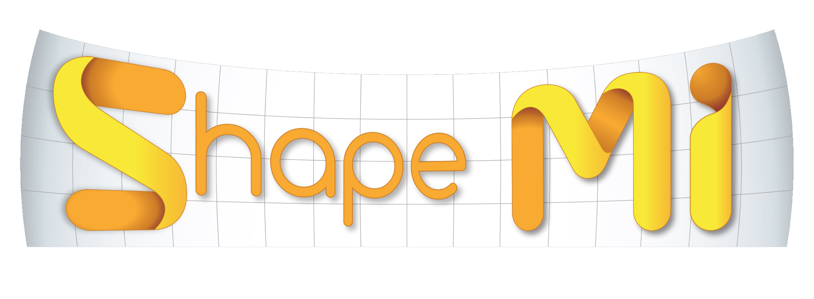
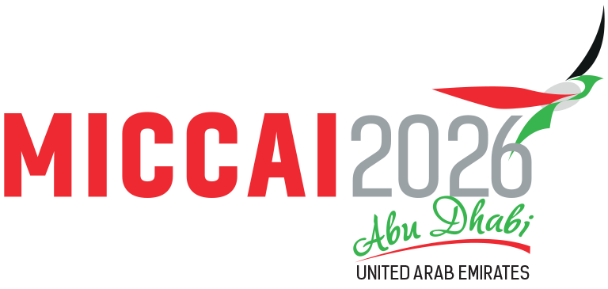

 We gladly announce the workshop on Shape in Medical Imaging (ShapeMI), which is held in conjunction with the conference on Medical Image Computing and Computer Assisted Interventions (<a href="https://conferences.miccai.org/2026/en/default.asp" target="_blank">MICCAI 2026</a>) in Abu Dhabi, UEA. This workshop is the sixth instance of ShapeMI, after successful <a href="https://shapemi.github.io/shapemi2018/" target="_blank">ShapeMI'18</a>, <a href="https://shapemi.github.io/shapemi2020/" target="_blank">ShapeMI'20</a>,  <a href="https://shapemi.github.io/shapemi2023/" target="_blank">ShapeMI'23</a>, <a href="https://shapemi.github.io/shapemi2024/" target="_blank">ShapeMI'24</a>, and <a href="https://shapemi.github.io/shapemi2025/" target="_blank">ShapeMI'25</a>.

This workshop aims to present leading methods and applications for advanced shape
analysis and geometric learning in medical imaging. It will provide a venue for researchers
working in shape and geometric modeling, learning, analysis, statistics, classification, and
applications to share novel ideas, present recent research results, and interact with each
other.
Today’s medical image data typically represent three-dimensional geometric structures and
dynamic, time-varying anatomical processes. Shape and geometry processing methods
continue to play a crucial role because of their sensitivity to subtle morphological variations.
Data-driven differential geometry for shape and spectral analysis and modeling remains a
central focus of this workshop. At the same time, rapid advances in deep learning research
are reshaping how the mathematical foundations of computational anatomy are used.
A new theme of ShapeMI 2026 is how shape is being integrated with modern AI
architectures. Recent progress in transformer-based point cloud models, equivariant
neural networks, neural fields, and large geometric foundation models is reshaping how
core concepts of computational anatomy are operationalized through applied research in
healthcare. We will look forward to receiving methodology or applied research in topics that

emphasize how classical shape theory informs the design, interpretability, and
generalization of modern geometric deep learning models. Furthermore, anatomical shape
does not exist in isolation, and biomedical research that only includes shape will generate
discoveries that will remain siloed within the structural realm. This workshop will place
special emphasis on multi-modal and multi-scale shape-driven biomarkers, including the
fusion of shape descriptors with multiomics data, clinical and electronic health records,
longitudinal disease trajectories, and biomechanical simulations. This focus reflects a
growing shift from shape analysis as a standalone methodology toward shape-informed,
integrative modeling pipelines for precision medicine and population-level inference.
 

# 2025 Proceedings

https://link.springer.com/book/10.1007/978-3-032-06774-6

# 2024 Proceedings

https://link.springer.com/book/10.1007/978-3-031-75291-9

# 2023 Proceedings

https://link.springer.com/book/10.1007/978-3-031-46914-5 

# Best paper award winners 2026 🏆

# Topics
This workshop targets theoretical contributions as well as exciting applications in medical imaging, including (but not limited to):

- Shape Processing and Analysis
- Shape Learning and Classification
- Geometric Learning and Manifold-based Methods
- Statistics of Shapes and Deformations
- Geometry-constrained Deep Learning and Optimization
- Synthetic Anatomical Shape Generation
- Generative Shape Models
- Spectral Shape Analysis
- Spectral Clustering and Dimensionality Reduction
- Shape Modeling and Representation
- Shape Segmentation, Registration and Correspondence
- Longitudinal Shape Analysis and Processing
- Multimodal AI integration using geometric features
- Large geometric foundation models
- Medical Applications Focused on Shape Analysis
- Evaluation / Quality Assessment of Shape Models
- Relevant Demos of Freely Available Shape Analysis Software

# Academic objectives
The workshop will call for paper submissions on three different topics, or combinations
thereof: methodology, applications, and software platforms in shape modeling and
statistics. The best papers will be presented in oral sessions. A poster session will host the
remaining accepted papers and will provide ample opportunity for in-depth discussion of all
submitted topics. As in previous years, we will encourage presenters to showcase any
software platform that resulted from the presented work. As a single-track workshop, ShapeMI will feature excellent <a href="https://shapemi.github.io/keynotes/">keynote speakers</a>, <a href="https://shapemi.github.io/submission/">technical paper presentations and demonstrations</a> of state-of-the-art software for shape processing in medical research. 

# Data (optional)
If you are looking for medical shapes for your work, take a look at <a href="https://medshapenet.ikim.nrw/">MedShapeNet</a>, which is a large-scale dataset of 3D medical shapes.

# Organizers
- [Christian Wachinger](http://wachinger.devweb.mwn.de/people/), Technical University of Munich, Munich, Germany
- [Beatriz Paniagua](https://www.kitware.com/beatriz-paniagua/), Kitware Inc, Carrboro, US and University of North Carolina in Chapel Hill, Chapel Hill, US
- [Gijs Luijten](https://mml.ikim.nrw/authors/gijs-luijten/), Institute for Artificial Intelligence in Medicine, University Hospital Essen, Essen, Germany
- [Shireen Elhabian](http://www.sci.utah.edu/~shireen/), School of Computing, Scientific Computing and Imaging Institute, University of Utah, USA
- [Karthik Gopinath](https://lcn.martinos.org/people/karthik-gopinath/), Harvard Medical School, Massachusetts General Hospital, USA
- [Jan Egger](http://www.janegger.de/), Institute for Artificial Intelligence in Medicine, University Hospital Essen, Essen, Germany

# Advisory Board / Program Committee

As in previous years, we will have a highly qualified advisory board, similar to ShapeMI 2018, 2020, 2023, 2024, and 2025, as listed below.

- Aasa Feragen, DIKU
- Claudia Lindner, U Manchester
- Diana Mateus, EC Nantes
- Ellen Gasparovic, Union College, NY
- Ender Konukoglu, ETH Zürich
- Guido Gerig, NYU
- James Fishbaugh, NYU
- Julia Schnabel, TUM
- Julien Lefèvre, U Aix-Marseille
- Kathryn Leonard, OXI
- Kilian Pohl, SRI International
- Marc Niethammer, UCSD
- Martin Styner, UNC
- Marius Linguraru, Children’s National Medical Center
- Miaomiao Zhang, UVA
- Philippe Buechler, U Bern
- Stefan Sommer, U Copenhagen
- Steve Pizer, UNC
- Tim Cootes, U Manchester
- Tinashe Mutsvangwa, U Cape Town
- Thomas Vetter, U Basel
- Umberto Castellani, U Verona
- Washington Mio, FSU
- Xavier Pennec, INRIA Sophia Antipolis
- Yonggang Shi, USC
- Yoshinobu Sato, NAIST
- Herve Lombaert, ETS Montreal, Canada & Inria Sophia-Antipolis, France
- Martin Reuter, German Center for Neurodegenerative Diseases, Bonn, Germany &
Harvard Medical School, Boston, USA
- Bernhard Egger, FAU Erlangen-Nbg
- Jens Kleesiek, UK Essen, Essen, Germany
- Behrus Puladi, RWTH Aachen

# Sponsor
TBD
