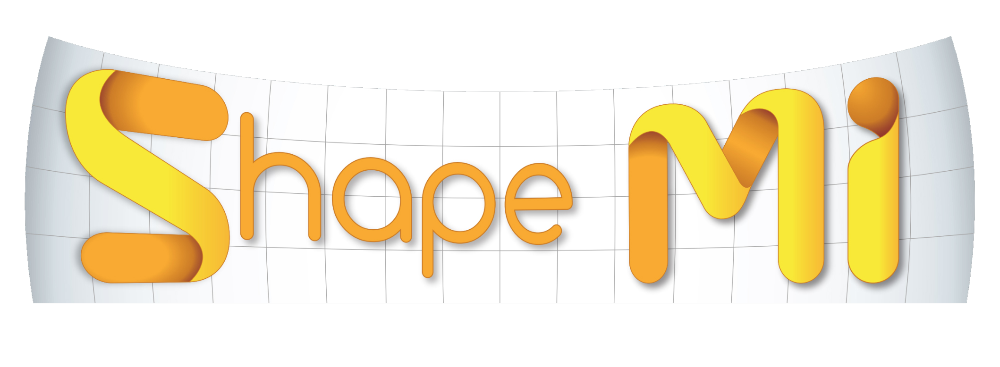
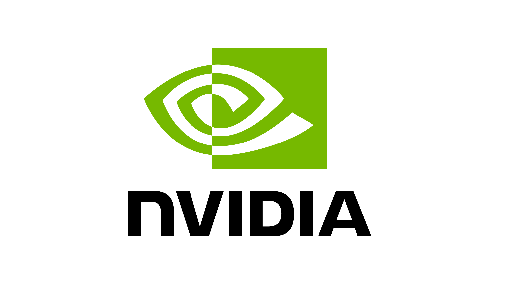
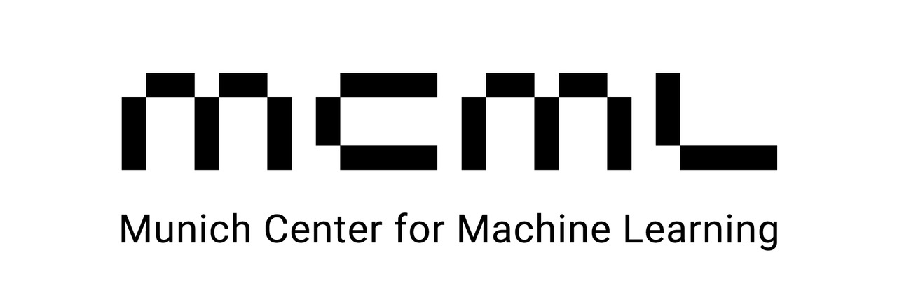

 We gladly announce the workshop on Shape in Medical Imaging (ShapeMI), <b>27th of September (8.00 - 12.30) in the Berlin (G) room</b>, which is held in conjunction with the conference on Medical Image Computing and Computer Assisted Interventions (<a href="https://conferences.miccai.org/2026/en/default.asp" target="_blank">MICCAI 2026</a>) in Strasbourg, France. This workshop is the sixth instance of ShapeMI, after successful <a href="https://shapemi.github.io/shapemi2018/" target="_blank">ShapeMI'18</a>, <a href="https://shapemi.github.io/shapemi2020/" target="_blank">ShapeMI'20</a>,  <a href="https://shapemi.github.io/shapemi2023/" target="_blank">ShapeMI'23</a>, <a href="https://shapemi.github.io/shapemi2024/" target="_blank">ShapeMI'24</a>, and <a href="https://shapemi.github.io/shapemi2025/" target="_blank">ShapeMI'25</a>.

This workshop aims to present leading methods and applications for advanced shape
analysis and geometric learning in medical imaging. It will provide a venue for researchers
working in shape and geometric modeling, learning, analysis, statistics, classification, and
applications to share novel ideas, present recent research results, and interact with each
other.
Today’s medical image data typically represent three-dimensional geometric structures and
dynamic, time-varying anatomical processes. Shape and geometry processing methods
continue to play a crucial role because of their sensitivity to subtle morphological variations.
Data-driven differential geometry for shape and spectral analysis and modeling remains a
central focus of this workshop. At the same time, rapid advances in deep learning research
are reshaping how the mathematical foundations of computational anatomy are used.
A new theme of ShapeMI 2026 is how shape is being integrated with modern AI
architectures. Recent progress in transformer-based point cloud models, equivariant
neural networks, neural fields, and large geometric foundation models is reshaping how
core concepts of computational anatomy are operationalized through applied research in
healthcare. We will look forward to receiving methodology or applied research in topics that emphasize how classical shape theory informs the design, interpretability, and
generalization of modern geometric deep learning models. Furthermore, anatomical shape
does not exist in isolation, and biomedical research that only includes shape will generate
discoveries that will remain siloed within the structural realm. This workshop will place
special emphasis on multi-modal and multi-scale shape-driven biomarkers, including the
fusion of shape descriptors with multiomics data, clinical and electronic health records,
longitudinal disease trajectories, and biomechanical simulations. This focus reflects a
growing shift from shape analysis as a standalone methodology toward shape-informed,
integrative modeling pipelines for precision medicine and population-level inference.
 

# Posters and pitch videos

Posters and 1-minute pitch videos for the 2026 papers, as received. Browse all files: [posters](https://drive.google.com/drive/folders/1zNn2ftvdX2Px8y5ryPYfZopTW7zQPCf0) · [pitch videos](https://drive.google.com/drive/folders/1T2TbnsCe5qCDkwY4QeQZwuftqS8DxYJa). Entries marked — have not reached us yet and are added as they arrive.

**Oral presentations** (slides are not published here)

| # | Title | Authors |
|---|---|---|
| #3 | AutoFFS: Adversarial Deformations for Facial Feminization Surgery Planning | Paul Friedrich, Florentin Bieder, Florian M. Thieringer et al. |
| #12 | SPVR: Explicit Shape-Prior-Guided 3D Vertebral Reconstruction from Orthogonal Projections | Marijn de Lange, Jianing Wang, Han Liu et al. |
| #18 | Deep Shape Regression for Planar Curves with Multimodal Covariates | Manuel Pfeuffer, Roshan Prakash Rane, Hadya Yassin et al. |
| #19 | ZODIAC: Zero-shot Octree-based Diffusion for Anatomical Completion | Miruna-Alexandra Gafencu, Vlad Bratulescu, Yordanka Velikova et al. |
| #27 | Learning the Marfan Face: A Conditional Mesh VAE for Explainable Screening and Synthetic Generation | Giuseppe Maurizio Facchi, Raffaella Lanzarotti, Giuliano Grossi et al. |
| #47 | SCALP: Semi-Supervised Statistical Shape Modeling from Imperfect 3D Photogrammetry via Landmark-Anchored Spectral Warping | Nawazish Khan, Sanjay Bhandari, Sarang Joshi et al. |

**Posters**

| # | Title | Authors | Material |
|---|---|---|---|
| #4 | Exploring the Influence of Prenatal Alcohol Exposure on Face Shape and Brain Development | Daniel Zieger, Yana Kuznetcov, Maximilian Weiherer et al. | [Poster](https://drive.google.com/file/d/1Fyx-xmaaqnRUx4nfH6dOlC_TT-nA_hV-/view?usp=sharing) · [1-min pitch](https://drive.google.com/file/d/13BAcGLvCzPzUH8BhoXiLYnhc5Ae29CkI/view?usp=sharing) |
| #6 | Landmark Detection Supported by Anatomy Segmentation and Geometric Constraints | Loris Giordano, Sebastian Amador Sanchez, Tom Lenaerts et al. | [Poster](https://drive.google.com/file/d/10LavsdUi3hwI_O4KOb4F9bhqNzRtgQ_B/view?usp=sharing) · [1-min pitch](https://drive.google.com/file/d/1gUgpE8I2RjmLvk1yGbFGDgknDyWlgeQW/view?usp=sharing) |
| #7 | Learning to Reconnect: Graph-based Path Classification For Restoring Retinal Vessel Segmentation Connectivity | Oscar Morand, Nathan Painchaud, Jonathan Fabrizio et al. | [Poster](https://drive.google.com/file/d/14MBtbdbkoK3F6Kev-SbUdT7SfWU6VG38/view?usp=sharing) · [1-min pitch](https://drive.google.com/file/d/106ZBkwAlFaHLDLbaMN5tIag4wOytdje4/view?usp=sharing) |
| #9 | On the Viability of Semi-Supervised Segmentation Methods for Statistical Shape Modeling | Asma Khan, Tushar Kataria, Janmesh Ukey et al. | [Poster](https://drive.google.com/file/d/1jFnU-5gcFeGW5ph8InQBZYLtBbumV6ho/view?usp=sharing) · [1-min pitch](https://drive.google.com/file/d/1rFizhrpOsps3sNzuoJXMCjEu8x3zY9xJ/view?usp=sharing) |
| #10 | Spherical RePaint: Label-Reusable Diffusion-Based Augmentation for Parcellation | Kangmin Kim, Jongmin Kim, Jiwon Son et al. | [Poster](https://drive.google.com/file/d/1-99JoDGKKoVPIOP7Y3yoQgY5PN_rUISG/view?usp=drive_link) · [1-min pitch](https://drive.google.com/file/d/1osJflpRECall5cGNecSdKcTXxdTw_Akk/view?usp=drive_link) |
| #13 | Mind the Gap: Mesh-Guided Repair of Broken Vessels | Gniewosz Drwiega, Wojciech Szymanski, Marek Wodzinski | [Poster](https://drive.google.com/file/d/1bDY_aJBoRmZXB_5kmnq9jau-5gewCssi/view?usp=sharing) · [1-min pitch](https://drive.google.com/file/d/10VWw3I5oylHuc5-AeljJhKIAEgXYbWWX/view?usp=sharing) |
| #14 | A Joint 2D–3D Statistical Shape Model for Orthopedic Reconstruction | Florence Dell'Aniello Picard, Pranav Poudel, Nairouz Shehata et al. | [Poster](https://drive.google.com/file/d/1ws10BLKQr_gvy0btNrpSBy9cXpKfVuPg/view?usp=sharing) · [1-min pitch](https://drive.google.com/file/d/1Fsk0RVsYDE2GDbT0L4MbhzY_lsNFUFJc/view?usp=sharing) |
| #15 | VessComNet: Geometry-Aware 3D Vessel Completion Across Non-Contrast and Contrast-Enhanced CT Images | Linlin Yao, Vivek Batheja, Praveen Thoppey Srinivasan Balamuralikrishna et al. | [Poster](https://drive.google.com/file/d/1yDIf6lza0JUubnIPLtkzjIQGSfT3TAZY/view?usp=sharing) · [1-min pitch](https://drive.google.com/file/d/1nw7JHAvf4hyX73W91qU8T6jFvuRjVYm4/view?usp=sharing) |
| #16 | What Does Anatomical Shape Know About You? A Multi-Organ, Shape-Only Study of Demographic Prediction, Attribution, and Privacy | Gijs Luijten, Behrus Hinrichs-Puladi, Merlin Engelke et al. | [Poster](https://drive.google.com/file/d/1qdeUiXqux1JwVs-n7qOzD4hQnl4jmTV3/view?usp=sharing) · [1-min pitch](https://drive.google.com/file/d/1fRMLZ-lTrHN45gGkubRCJw3kYYHxCygc/view?usp=sharing) · [3-min](https://drive.google.com/file/d/1Q3kv6e6JW0y2nyI6Ln8Q_Ly18q_muZNi/view?usp=sharing) |
| #17 | Predicting The Progression of Adolescent Idiopathic Scoliosis | Owen Pullen, Amir Jamaludin, Andrew Zisserman | [Poster](https://drive.google.com/file/d/10p7XUuTZxb00a6_hocHoSt0nM4cp-_vs/view?usp=sharing) · [1-min pitch](https://drive.google.com/file/d/1RYL30taRycrK4TKcGjUXpsmMnljhS6x0/view?usp=sharing) |
| #20 | Segmentation and keypoints transfer for volumetric medical shapes via functional maps | Francesca Maccarone, Filippo Maggioli, Denis Peruzzo et al. | [Poster](https://drive.google.com/file/d/1bUNFjalnnCMTu0vCOYvPMtckTQR-ajw4/view?usp=sharing) · [1-min pitch](https://drive.google.com/file/d/14Y3dBK0HT8rgfoRQcV9sE2A0yrwsruNj/view?usp=sharing) |
| #21 | PanVasc: A Shape-Aware Framework for Peripancreatic Vascular Invasion Assessment in Pancreatic Ductal Adenocarcinoma | Muhammad Ibtsaam Qadir, Alexa J. Hughes, Ryan J. Ellis et al. | [Poster](https://drive.google.com/file/d/15hU2o040rKL6V6sZBQjBGje8aRn0cD80/view?usp=sharing) |
| #22 | Extending the Evolutionary Skeletal Representation to the Cerebral Cortex Anatomy | David Allemang, Jared Vicory, Stephen Pizer | [Poster](https://drive.google.com/file/d/1xc5IlYd1gqX7aRI6rKmlnGBNEZUnc1cT/view?usp=sharing) · [1-min pitch](https://drive.google.com/file/d/1wxsmHVOibxO7FNOlX8Dggeou-gsoCx5L/view?usp=sharing) |
| #25 | BlendNet: on the Importance of Accurate Local Pre-Registration in the Image Registration Task | Gabriel Ravelomanana, Julien Pansiot, Sergi Pujades | [Poster](https://drive.google.com/file/d/1ZrVLdsJa66DZnqo20afIXEcvAXPT3_rk/view?usp=sharing) · [1-min pitch](https://drive.google.com/file/d/1ZNwM7sMe7Jz1FwHqMfe_Ni35pI8HbiNm/view?usp=sharing) |
| #26 | Medial Skeletons for Haustral Fold Detection in Colonoscopy | Samuel Ehrenstein, Sarah McGill, Julian Rosenman et al. | — |
| #28 | Disentangled Geometric Variational Learning of Normative Pediatric Development from Anatomical Surface Representations of Patients with Pathology | Joseph Nagel, Ines Alejandro Cruz Guerrero, Brooke French et al. | [Poster](https://drive.google.com/file/d/150Hj2txM5IZR0k4zcTpwNW1JI-xGVVZ3/view?usp=sharing) · [1-min pitch](https://drive.google.com/file/d/19eOpKTKe-7mop-uFYLtRUWR21iXdoTLc/view?usp=sharing) |
| #31 | Cardiac Shape Priors for Equivariant Neural Field Representations of Cine MRI | Sacha Buijs, Fleur Valerie Yuen Tjong, Erik J Bekkers et al. | [Poster](https://drive.google.com/file/d/13pQaNgsZ65e62AMTmBnqCoK58rzFjQLL/view?usp=sharing) · [1-min pitch](https://drive.google.com/file/d/1jOt2-Vo5gtkNCuZ91PaOrp0ATZOPOkQi/view?usp=sharing) |
| #33 | TRACE: Artifact-Robust Statistical Shape Modeling from Imperfect Surface Scans - A Case Study in Craniosynostosis 3D Photography | Sanjay Bhandari, Nawazish Khan, Alzbeta Novotna et al. | [Poster](https://drive.google.com/file/d/1XEKRnAY5TbUR3nBQcESZypJ_8XIb82ZP/view?usp=sharing) · [1-min pitch](https://drive.google.com/file/d/139VlJfy_msn5ZX6QLK8z0FSH5pqxyYGj/view?usp=sharing) |
| #35 | DINE: Distance Is Not Enough Learning Global Deformation Priors for Robust Soft-Tissue Point Cloud Registration | Sara Homscheid, Rohit Beer, Marvin Kinz et al. | [Poster](https://drive.google.com/file/d/1GJrrAUG6WMxZzfhWu4llKPDEAEvmC7qW/view?usp=drive_link) · [1-min pitch](https://drive.google.com/file/d/1FnBRGQQB1wUVMFRSlX9NAZhcWKX80aEA/view?usp=drive_link) |
| #36 | Interpretable Obstructive Sleep Apnea Screening from MRI-Derived Upper-Airway Surface Morphology with Class Node Graph Attention Networks | Aryan Mokhtari Saghafi, Jay Devine, Kaat Pauwels et al. | [Poster](https://drive.google.com/file/d/1Up6cVS_ADj3ojybZe8RflPKJ2kGccP3o/view?usp=sharing) · [1-min pitch](https://drive.google.com/file/d/1otzbEeZsZSQBq3Q0TJgW4IQ6BWzWyGJs/view?usp=sharing) |
| #37 | KneeFlow: A Flow Matching Framework for Patient-Specific Knee Reconstruction | Ragavan Srinivasan, Vivek maik, Manojkumar Lakshmanan et al. | — |
| #38 | Multiscale Wave-Shaping Neural Encoding with Cross-Attention Networks for 3D Organ Reconstruction and Generation | Diego Alejandro Flores Menjivar, Panagiotis Kalozoumis, Dimitris Iakovidis | [Poster](https://drive.google.com/file/d/1QFPYH_ZfOWYOneI7Kfd7B2OEdlkIiKQw/view?usp=sharing) · [1-min pitch](https://drive.google.com/file/d/1t9-yIVayQoa1WYh5xQndlid3KgQmFKhH/view?usp=sharing) |
| #40 | Rethinking Sequence Modeling on Cortical Surfaces: Robustness, Spatial Ordering, and Resolution in Infant Brain Age Prediction | Hye Jin Yoon, Jin Kyu Gahm | [Poster](https://drive.google.com/file/d/1PKl1gQCYviLVVP6jAI-7XOl3stmNLIZx/view?usp=sharing) · [1-min pitch](https://drive.google.com/file/d/1dtZxYAKU8KufSML-WuA-5vdIumXzlfby/view?usp=sharing) |
| #41 | An Implicit 3D Face and Palate Shape Model for Infant Orofacial Clefts | Till N. Schnabel, Yoriko Lill, Maximilian Weiherer et al. | [Poster](https://drive.google.com/file/d/1vlCKkM1fdr8Yml0LRoUTIHAy1-8qazmD/view?usp=drive_link) · [1-min pitch](https://drive.google.com/file/d/1h0TSAKg3iuEwP9sZltSgi-DRpmnn_k4a/view?usp=drive_link) · [3-min](https://drive.google.com/file/d/1cihpyaBYw8o82DueiqXzcurxVkxE68SW/view?usp=drive_link) |
| #42 | NO2SSM: A Discretization-Invariant Neural-Operator Approach to Statistical Shape Modeling | Abu Zahid Bin Aziz, Shireen Elhabian | [Poster](https://drive.google.com/file/d/1vNO3M4uorhx7gModgD9LOtgaPa6J4qyd/view?usp=sharing) · [1-min pitch](https://drive.google.com/file/d/1LjiFazUn7MUCDAZbKDZAbRVtyFvROabJ/view?usp=sharing) |
| #43 | Learning To Focus: Anatomy-Guided Attention Regularization for Medical Image Classification | Tonmoy Hossain, Md. Atiqur Rahman, Farhana Hossain Swarnali et al. | [1-min pitch](https://drive.google.com/file/d/1ipxsqM0elmSWm4oj3ZIlsuZLsu-2sjqs/view?usp=drive_link) |
| #44 | Predicting Brain Morphometry with MT-GNN: Mesh Evolution in Continuous Time with Graph-Based Metric Tensor Embeddings | Hao Ding, Daniel Semchin, Paul Thompson et al. | [Poster](https://drive.google.com/file/d/1SHQR7cSnev2n_-ZSXXaIQIM0bken0aXz/view?usp=sharing) · [1-min pitch](https://drive.google.com/file/d/1a25cPGYH541ACLqoLdhWwa5oj3qyVpSH/view?usp=sharing) |
| #45 | Machine learning on subcortical brain features: A study of sample size efficiency for neurodegenerative disease classification | Yanghee Im, Melody J.Y. Kang, Boris Gutman et al. | [Poster](https://drive.google.com/file/d/1q4hNoRgNPOnL8sBNiiJITO5grICfgDUg/view?usp=sharing) · [1-min pitch](https://drive.google.com/file/d/1Zrb2zZeYx-OMd7JjytFsdXAt93QKnOV5/view?usp=sharing) |
| #46 | Mixture of Experts for Fine-Grained Shape Refinement in Medical Segmentation | Denisa Checiu, Giacomo Grazia, Arshana Ramautar et al. | [Poster](https://drive.google.com/file/d/1eliJ-YLMl-q_w1eiRkL-AfWDu-W9ubaA/view?usp=sharing) · [1-min pitch](https://drive.google.com/file/d/1FCWL7-hNuyyPYt8Kgwtz3SPIIPM0pb80/view?usp=sharing) |

# 2025 Proceedings

https://link.springer.com/book/10.1007/978-3-032-06774-6

# 2024 Proceedings

https://link.springer.com/book/10.1007/978-3-031-75291-9

# 2023 Proceedings

https://link.springer.com/book/10.1007/978-3-031-46914-5 

# Best paper award winners 2026 🏆

# Topics
This workshop targets theoretical contributions as well as exciting applications in medical imaging, including (but not limited to):

- Shape Processing and Analysis
- Shape Learning and Classification
- Geometric Learning and Manifold-based Methods
- Statistics of Shapes and Deformations
- Geometry-constrained Deep Learning and Optimization
- Synthetic Anatomical Shape Generation
- Generative Shape Models
- Spectral Shape Analysis
- Spectral Clustering and Dimensionality Reduction
- Shape Modeling and Representation
- Shape Segmentation, Registration and Correspondence
- Longitudinal Shape Analysis and Processing
- Multimodal AI integration using geometric features
- Large geometric foundation models
- Medical Applications Focused on Shape Analysis
- Evaluation / Quality Assessment of Shape Models
- Relevant Demos of Freely Available Shape Analysis Software

# Academic objectives
The workshop will call for paper submissions on three different topics, or combinations
thereof: methodology, applications, and software platforms in shape modeling and
statistics. The best papers will be presented in oral sessions. A poster session will host the
remaining accepted papers and will provide ample opportunity for in-depth discussion of all
submitted topics. As in previous years, we will encourage presenters to showcase any
software platform that resulted from the presented work. As a single-track workshop, ShapeMI will feature excellent <a href="https://shapemi.github.io/keynotes/">keynote speakers</a>, <a href="https://shapemi.github.io/submission/">technical paper presentations and demonstrations</a> of state-of-the-art software for shape processing in medical research. 

# Data (optional)
If you are looking for medical shapes for your work, take a look at <a href="https://medshapenet.ikim.nrw/">MedShapeNet</a>, which is a large-scale dataset of 3D medical shapes.

# Organizers
- [Christian Wachinger](http://wachinger.devweb.mwn.de/people/), Technical University of Munich, Munich, Germany
- [Beatriz Paniagua](https://www.kitware.com/beatriz-paniagua/), Kitware Inc, Carrboro, US and University of North Carolina in Chapel Hill, Chapel Hill, US
- [Gijs Luijten](https://mml.ikim.nrw/authors/gijs-luijten/), Institute for Artificial Intelligence in Medicine, University Hospital Essen, Essen, Germany
- [Shireen Elhabian](http://www.sci.utah.edu/~shireen/), School of Computing, Scientific Computing and Imaging Institute, University of Utah, USA
- [Karthik Gopinath](https://lcn.martinos.org/people/karthik-gopinath/), Harvard Medical School, Massachusetts General Hospital, USA
- [Jan Egger](http://www.janegger.de/), Institute for Artificial Intelligence in Medicine, University Hospital Essen, Essen, Germany

# Advisory Board / Program Committee
As in previous years, we will have a highly qualified advisory board, similar to ShapeMI 2018, 2020, 2023, 2024, and 2025, as listed below.

- Kumar Abhishek, Simon Fraser University, Burnaby, Canada
- Suyash Awate, Indian Institute of Technology Bombay, Mumbai, India
- Devkumar Biswas, Indian Institute of Technology Ropar, Rupnagar, India
- Satrajit Chakrabarty, GE HealthCare, San Ramon, United States
- Tim Cootes, University of Manchester, Manchester, United Kingdom
- Saher Elsayed, University of Pennsylvania, Philadelphia, United States
- André Ferreira, University of Minho, Braga, Portugal
- Ellen Gasparovic, Union College, Schenectady, United States
- Palak Handa, Danube Private University, Krems, Austria
- Tonmoy Hossain, Harvard Medical School & Massachusetts General Hospital, Boston, United States
- Krithika Iyer, Children's National Hospital, Washington, D.C., United States
- Jens Kleesiek, UK Essen, Essen, Germany
- Chaitanya Kolluru, Elucid Bioimaging, Boston, United States
- Kathryn Leonard, Occidental College, Los Angeles, United States
- Hao Li, Vanderbilt University, Nashville, United States
- Diana Mateus, École Centrale de Nantes, Nantes, France
- Kaveh Moradkhani, École de technologie supérieure, Montreal, Canada
- Krishna Mridha, Case Western Reserve University, Cleveland, United States
- Mohammad Mehedi Hasan Munna, East West University, Dhaka, Bangladesh
- Marc Niethammer, University of California San Diego, San Diego, United States
- Ilkay Oksuz, Istanbul Technical University, Istanbul, Turkey
- Steve Pizer, University of North Carolina at Chapel Hill, Chapel Hill, United States
- Behrus Hinrichs-Puladi, RWTH Aachen University, Aachen, Germany
- Md Mostafijur Rahman, University of Texas at Austin, Austin, United States
- Mira Rizkallah, Laboratoire des Sciences du Numérique de Nantes, Nantes, France
- Farnaz Sheikhi, University of Calgary, Calgary, Canada
- Stefan Sommer, University of Copenhagen, Copenhagen, Denmark
- Martin Styner, University of Basel, Basel, Switzerland & University of North Carolina, Chapel Hill, USA
- Matthias Wilms, University of Michigan, Ann Arbor, United States

# Sponsors

We are delighted to announce the generous support that is helping make **MICCAI 2026** possible.

This year, we are proud to welcome **NVIDIA, HeartFlow, and the Munich Center for Machine Learning (MCML)** as our sponsors. Their support helps us bring together researchers, clinicians, and innovators from around the world to advance the future of medical image computing and computer assisted intervention.

**We sincerely thank our sponsors for supporting the community and helping us make MICCAI 2026 happen.**

Sponsor websites and sponsor-talk details are on the [Sponsors page](/sponsors/).

 

   

   

  

