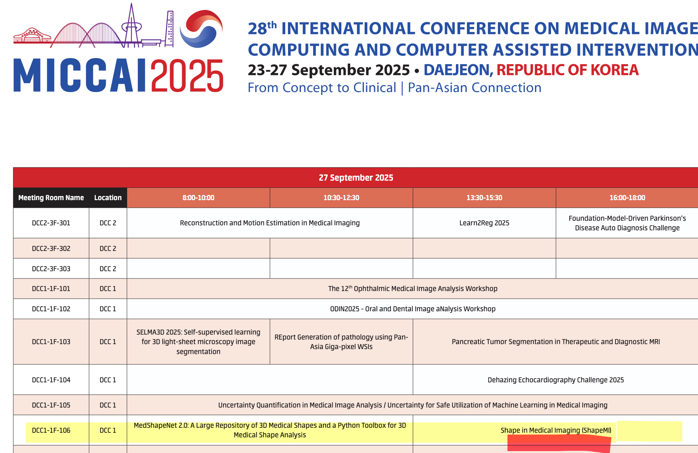

# ShapeMI MICCAI 2025: Workshop on Shape in Medical Imaging

**Date**: Saturday, 27 September 2025  
**Time**: 13:30–18:00  

{width=400px}

---

## Session 1
**Session chair**: Gijs Luijten

| Time         | Title                                                                                                           | Speaker(s) |
|:-------------|:----------------------------------------------------------------------------------------------------------------|:-----------|
| 13:30–13:40  | Introduction to the ShapeMI workshop                                                                            | Gijs Luijten |
| 13:40–14:25  | **Keynote**: 3D Shape Analysis: From Discrete Optimization to Deep Spectral Matching                           | Lennart Bastian |
| 14:25–14:45  | Parametric shape models for vessels learned from segmentations via differentiable voxelization                  | *Alina Dima*; Suprosanna Shit; Huaqi Qiu; Robbie Holland; Tamara Mueller; Fabio Musio; Kaiyuan Yang; Bjoern Menze; Rickmer Braren; Marcus Makowski; Daniel Rueckert |
| 14:45–15:05  | US-X Complete: A Multi-Modal Approach to Anatomical 3D Shape Recovery                                           | *Miruna-Alexandra Gafencu*; Yordanka Velikovva; Nassir Navab; Mohammad Farid Azampour |
| 15:05–15:25  | Large Intestine 3D Shape Refinement Using Conditional Latent Point Diffusion Models                             | *Kaouther Mouheb*; Mobina Ghojogh Nejad; Lavsen Dahal; Ehsan Samei; Kyle J. Lafata; W. Paul Segars; Joseph Y. Lo |
| 15:30–16:00  | **Coffee break**                                                                                                | — |

---

## Session 2
**Session chair**: Gijs Luijten

| Time         | Title                                                                                                           | Speaker(s) |
|:-------------|:----------------------------------------------------------------------------------------------------------------|:-----------|
| 16:00–16:45  | **Keynote**: The Role of Riemannian Geometry in Deep Learning                                                   | Tom Fletcher |
| 16:45–17:05  | Benchmarking Evaluation Metrics for Tubular Structure Segmentation in Biomedical Images                         | *Meghane Decroocq*; Charissa Poon; Matthias Schlachter; Henrik Skibbe |
| 17:05–17:25  | Anisotropic Fourier Features for Positional Encoding in Medical Imaging                                         | *Nabil Jabareen*; Dongsheng Yuan; Dingming Liu; Foo-Wei Ten; Sören Lukassen |
| 17:25–17:45  | Spherical Brownian Bridge Diffusion Models for Conditional Cortical Thickness Forecasting                       | *Fabian Bongratz*; Ivan Stoyanov; Christian Wachinger |
| 17:45–18:00  | Closing                                                                                                         | Gijs Luijten |

---

## Posters

* **PSGM-TR: A Transformer-Based Approach for Pulmonary Segment Segmentation Using Gaussian Mixture Models**  
  *Seunghee Koh*; Chanho Lee; Jaehyun Choi; Minseo Kim; Youngno Yoon; Changyoung Lee; Junmo Kim  
  📄 [Poster](https://drive.google.com/file/d/1GWW49kRImtV5Tz1_9sJuhzL4v-SUqric/view?usp=drive_link) · 🎥 [3-min Explainer](https://drive.google.com/file/d/1Uxjw56qsLqgsyBuM-sWd4whQQAhCxjKA/view?usp=drive_link)

* **A Unified Pipeline for Explainable Gait Analysis**  
  *Daniel Zieger*; Jann-Ole Henningson; Bernhard Egger; Marc Stamminger  
  📄 [Poster](https://drive.google.com/file/d/1O6X3hmwTIOeILkPWQ8NSp4rkA7jx8a-R/view?usp=drive_link) · 🎥 [3-min Explainer](https://drive.google.com/file/d/1EF3Qq9ZZclU6DqKmwa4PpbKSFJ_N4UK8/view?usp=drive_link)

* **ShapeKit**  
  Junqi Liu; Dongli He; Wenxuan Li; Ningyu Wang; Alan Yuille; *Zongwei Zhou*  
  📄 [Poster](https://drive.google.com/file/d/141XhJfpUMdTmd3clc9hZbinW1tvyZxPV/view?usp=drive_link) · 🎥 [3-min Explainer](https://drive.google.com/file/d/1Kgf3AZWyZUiHBqbHAUJ8QmSb1LL28W4W/view?usp=drive_link)

* **Posterior Shape Models Revisited: Improving 3D Reconstructions from Partial Data Using Target-Specific Models**  
  *Jonathan Aellen*; Florian Burkhardt; Thomas Vetter; Marcel Lüthi  
  📄 [Poster](https://drive.google.com/file/d/1hAKNF2857TPjlbEFH9zYg95oLkZqhdkX/view?usp=drive_link) · 🎥 [3-min Explainer](https://drive.google.com/file/d/11E-Aromli3mzWPIwwpQQIg58HeZHKgul/view?usp=drive_link)

* **Anatomically-Focused Patches for Lightweight and Explainable Knee OA Grading**  
  *Tien-En Chang*; Herve Lombaert  
  📄 [Poster](https://drive.google.com/file/d/1PAkztFKjC9AUdmyCeJWU1iQzFDYTcCHz/view?usp=drive_link) · 🎥 [3-min Explainer](https://drive.google.com/file/d/1prF1bniU--easwR5xN8mtj5xQv8Mko9O/view?usp=drive_link)

* **A Statistical 3D Stomach Shape Model for Anatomical Analysis**  
  *Erez Posner*; Ore Shtalrid; Oded Erell; Daniel Noy; Moshe Bouhnik  
  📄 [Poster](https://drive.google.com/file/d/1aoHtBo7Mp04k_m4cnZPst_sWt10Qw9Dg/view?usp=drive_link) · 🎥 [3-min Explainer](https://drive.google.com/file/d/109UHoHqW4vfTYOrORlqt0KQTIFjSfK1J/view?usp=drive_link)

* **AnatomyGen: Generating Anatomically Plausible Human Phantoms at High Resolution**  
  *Gasper Podobnik*; Nidhi Balodi; Benjamin Killeen; Tomaž Vrtovec; Mathias Unberath  
  📄 [Poster](https://drive.google.com/file/d/1sQp80f4R-sRiXh-9SnGsxKix9BSEVfEH/view?usp=drive_link) · 🎥 [3-min Explainer](https://drive.google.com/file/d/1Ak50tMgIV4dp2HTOKrwHXabti4gjcDHB/view?usp=drive_link)

* **Template-Based Cortical Surface Reconstruction with Minimal Energy Deformation**  
  *Patrick Madlindl*; Fabian Bongratz; Christian Wachinger  
  📄 [Poster](https://drive.google.com/file/d/12z1e38Zf89lHDJGD2s97xyzP1gOBygCj/view?usp=drive_link) · 🎥 [3-min Explainer](https://drive.google.com/file/d/1baotZun22hmdXCcEenHgDSdkNs_u6qwX/view?usp=drive_link)

* **OsteoDeform: Osteophyte-Aware Shape Deformations of Distal Femur Models for Surgical Planning in Total Knee Arthroplasty**  
  *Srivibha Parthasarathy*; Sowjanya Balaji; Vivek Maik; Manojkumar Lakshmanan; Mohanasankar Sivaprakasam  
  📄 [Poster](https://drive.google.com/file/d/1aJA9x6rsVUF1Wy7L_j78oee7_HdrP-al/view?usp=drive_link) · 🎥 [3-min Explainer](https://drive.google.com/file/d/1JTbRKjUio7vpXrywnN39fALVipuZTzO-/view?usp=drive_link)

* **Spline-based Shape Compression for Interventional Device Tracking**  
  *Roman Pavelkin*; Luis A. Zavala-Mondragon; Fons van der Sommen; Ahmet Ekin  
  📄 [Poster](https://drive.google.com/file/d/1f04fLZxTdeS43hPRkLw6KGiH7Nh_bmTa/view?usp=drive_link) · 🎥 [3-min Explainer](https://drive.google.com/file/d/1JTbRKjUio7vpXrywnN39fALVipuZTzO-/view?usp=drive_link)

* **End-to-End Learning of Multi-Organ Implicit Surfaces from 3D Medical Imaging Data**  
  *Farahdiba Zarin*; Nicolas Padoy; Jérémy Dana; Vinkle Srivastav  
  📄 [Poster](https://drive.google.com/file/d/1tHe2cPVVeTCvpA7x5kdfIGqhEIxa-XTC/view?usp=drive_link) · 🎥 [3-min Explainer](https://drive.google.com/file/d/1jLsA8U2UIHatufZD7b-Pco1YU2iQbcD7/view?usp=drive_link)

* **A Simple Modality-Agnostic Representation for Scoliosis Phenotyping**  
  *Owen Pullen*; Amir Jamaludin; Andrew Zisserman  
  📄 [Poster](https://drive.google.com/file/d/1M9lWk8xu2qUuIiIXi20GKlUJb_EZIHog/view?usp=drive_link) · 🎥 [3-min Explainer](https://drive.google.com/file/d/1bf41dblBOryRTC8PtymBut1ql0aVXJ3a/view?usp=drive_link)

* **A Scalable Toolkit for Modeling 3D Surface-based Brain Geometry**  
  Yanghee Im; Leila Nabulsi; Melody Kang; Sophia Thomopoulos; Ana Diaz Zuluaga; Anders Dale; Andriana Karuk; Annabella Giorgio; Benson Mwangi; Boris Gutman; Bronwyn Overs; Carlos Jaramillo; Colm McDonald; Dara Cannon; Dan Stein; David Glahn; Diego Hidalgo-Mazzei; Diliana Pecheva; Dominik Grotegerd; Edith Pomarol-Clotet; Eduard Vieta; Emilie Olie; Enric Chertó; Fabio Sambataro; Fleur Howells; Freda Scheffler; Geraldo Busatto; Gerard Anmella; Giovana Zunta-Soares; Gloria Roberts; Henk Temmingh; Ian Gotlib; Ingrid Agartz; Jair Soares; James Karantonis; James Prisciandaro; Janice Fullerton; Joaquim Radua; Jonathan Savitz; Josselin Houenou; Kang Sim; Kenichiro Harada; Klaus Berger; Koji Matsuo; Lakshmi Yatham; Lars Westlye; Lisa Eyler; Lisa Furlong; Luisa Klahn; Marco Hermesdorf; Marcus Zanetti; Matthew Kempton; Matthew Sacchet; Mikael Landen; Mon-Ju Wu; Pedro Rosa; Philip Mitchell; Pravesh Parekh; Raymond Salvador; Rayus Kuplicki; Salvador Sarró; Susan Rossell; Tamsyn Rheenen; Theodore Satterthwaite; Tilo Kircher; Tomas Hajek; Udo Dannlowski; Xavier Caseras; Yuji Zhao; Ole Andreassen; *Paul Thompson*; *Christopher Ching*  
  📄 [Poster](https://drive.google.com/file/d/1Z3yBibD3Nmojov_p6g4ua1l3i0P6vnU-/view?usp=drive_link) · 🎥 [3-min Explainer](https://drive.google.com/file/d/15GhS-A_en0Uzxo0GfjInQuoXyTifr8-d/view?usp=drive_link)

* **Deep Learning Enables Large-Scale Shape and Appearance Modeling in Total-Body DXA Imaging**  
  *Arianna Bunnell*; Devon Cataldi; Yannik Glaser; Thomas Wolfgruber; Steven Heymsfield; Alan Zonderman; Thomas Kelly; Peter Sadowski; John Shepherd  
  📄 [Poster](https://drive.google.com/file/d/1cSWXPIhqZehNBDudp0TVo0xuid_XDyhc/view?usp=drive_link) 

* **GReAT: Leveraging Geometric Artery Data to Improve Wall Shear Stress Assessment**  
  *Julian Suk*; Jolanda Wentzel; Patryk Rygiel; Joost Daemen; Daniel Rueckert; Jelmer Wolterink  
  📄 [Poster](PASTE-DRIVE-LINK) · 🎥 [3-min Explainer](https://drive.google.com/file/d/1FjLQNUp7Ot-34SUX7rSsD7UPsZTKtJ_Q/view?usp=drive_link)

* **Shape vs Flow: A 2D Statistical Shape Analysis of the Projection of Common Iliac Veins in Patients with Deep Vein Thrombosis**  
  *Magdalena Otta*; Karol Zając; Maciej Malawski; Ian Halliday; Chung Lim; Janice Tsui; Andrew Narracott  
  📄 [Poster](https://drive.google.com/file/d/1AwbXHDEvND1xoahLYuoQlVYcx72Kgtgy/view?usp=drive_link) · 🎥 [3-min Explainer](https://drive.google.com/file/d/1amU_9-ABZFRLJ_GsGq_9BayEQbC0K482/view?usp=drive_link)e

* **Implicit Shape-Prior for Few-Shot Assisted 3D Segmentation**  
  *Mathilde Monvoisin*; Louise Piecuch; Blanche Texier; Cédric Hémon; Anaïs Barateau; Jérémie Huet; Antoine Nordez; Anne-Sophie Boureau; Jean-Claude Nunes; Diana Mateus  
  📄 [Poster](https://drive.google.com/file/d/1ywKMayhVSjMSzlGeHQt-TXeQb-q7eCCU/view?usp=drive_link) · 🎥 [3-min Explainer](https://drive.google.com/file/d/1oQ_Zfa1YP9F3hn-1C6keLLsav7VC5AqH/view?usp=drive_link)

* **Point Set Registration Metrics Reloaded for Computer-Assisted Surgery**  
  *Xinzhe Du*; Shixing Ma; Mingyang Liu; Zhengyan Zhang; Zhe Min  
  📄 [Poster](https://drive.google.com/file/d/1AmjfVPEUl3uXU93YbJiKrWky6EmhPmrB/view?usp=drive_link) 

* **Benchmark-Ready 3D Anatomical Shape Classification**  
  *Tomáš Krsička*; Tibor Kubík  
  📄 [Poster](https://drive.google.com/file/d/1HZtZW_aCCC1z2GtjKMUcqGXAmJAfQ_US/view?usp=drive_link) · 🎥 [3-min Explainer](https://drive.google.com/file/d/1Y2P8Pn9rSUbkBnrBOitG7s6vECTV-4P6/view?usp=drive_link)

* **SimCortex: Collision-Free Simultaneous Cortical Surfaces Reconstruction**  
  *Kaveh Moradkhani*; R. Jarrett Rushmore; Sylvain Bouix  
  📄 [Poster](https://drive.google.com/file/d/19x2Kb5iIVYGme3tedPig5pSj77t43-mJ/view?usp=drive_link)

* **Parametric shape models for vessels learned from segmentations via differentiable voxelization**  
  *Alina Dima*; Suprosanna Shit; Huaqi Qiu; Robbie Holland; Tamara Mueller; Fabio Musio; Kaiyuan Yang; Bjoern Menze; Rickmer Braren; Marcus Makowski; Daniel Rueckert  
  📄 [Poster](https://drive.google.com/file/d/16PDovPDkWaDEMgrvSAZD4M_m_Q8BDWQY/view?usp=drive_link) 

Some presenters also shared a poster and short video alongside their oral talk on last notice.  
These materials are listed here for reference.

* **[Anisotropic Fourier Features for Positional Encoding in Medical Imaging]**  
  *Nabil Jabareen; Dongsheng Yuan; Dingming Liu; Foo-Wei Ten; and Sören Lukassen*  
  📄 [Poster](https://drive.google.com/file/d/1yy4d4vLQ_COCzyLK7A5CGs1T1JhdyrwK/view?usp=drive_link) · 🎥 [3-min Explainer](https://drive.google.com/file/d/12b0nrxYP1FSpvy6jA8vMccmv0EEaMQoB/view?usp=drive_link)

* **[US-X Complete: A Multi-Modal Approach to Anatomical 3D Shape Recovery]**  
  *Miruna-Alexandra Gafencu; Yordanka Velikova; Nassir Navab and Mohammad Farid Azampour*  
  📄 [Poster](https://drive.google.com/file/d/1u913yl5ZJPr91Aq8UZT9cC0gfihQTADR/view?usp=drive_link) · 
