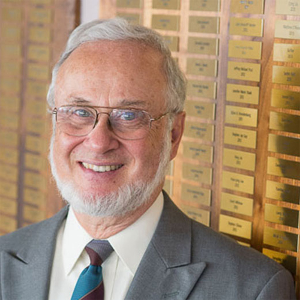

# Keynotes

## Anuj Srivastava

Anuj Srivastava is a Professor in the Department of Statistics and a Distinguished Research Professor at the Florida State University. He obtained his Ph.D. from Washington University in St. Louis; after being a postdoc at Brown University for one year, he joined the faculty of FSU in 1997. His research interests include statistical analysis on nonlinear manifolds, statistical computer vision, functional data analysis, and shape analysis. He has held several visiting positions at European universities, including INRIA, France,  the University of Lille, France, and Durham University, UK. He has co-authored more than 350 papers in peer-reviewed journals, top-tier conferences, and several books, including the 2016 Springer textbook on "Functional and Shape Data Analysis." He is a fellow of several institutions in Statistics (IMS and ASA), electrical engineering (IEEE), and computer science (AAAS and IAPR).  
<b>Title:</b> Statistical Shape Analysis of Complex Natural Structures 
<b>Abstract:</b> Statistical analysis of shape data is a fast-growing field with broad applications. Rapid advances in imaging techniques have led to rich data for analyzing shapes across many scientific disciplines. Examples include shapes of cancer cells, botanical trees, human biometrics, 3D genome, anatomical structures, complex scenes, and so on. Shapes are relevant even in non-imaging data contexts, e.g., the shapes of COVID rate curves or the shapes of breathing patterns in sleep studies.  Imposing statistical models and inferences on shapes seems daunting because the shape is an abstract notion and one requires mathematical representations to quantify shapes. In this talk, I will present some recent developments in elastic shape representations of complex structures such as curves, surfaces, trees, networks, and graphs.  I will focus on statistical analyses:  computing shape summaries, estimation under shape constraints, hypothesis testing, time-series models, and regression models involving shapes.  

## Steve Pizer 

Dr. Steve pizer was the author of the first PhD dissertation in medical image computing, at Harvard and Mass. General Hospital in 1967. He has been teaching, research advising, writing, and doing research in that area continuously since then. In past years his research focused on image quality restoration, 2D and 3D display, and models of human vision. For the last decade he led research on computer vision methods using deep learning to reconstruct surfaces viewed by endoscopic video, most recently in colonoscopy. For the last 4 decades his focus has been on geometric models of anatomic objects, statistical analyses of these, and the applications of that in object segmentation, registration, and diagnosis. My medical target problems have come from radiation oncology, neuroscience, GI medicine, radiology, neurosurgery, and dentistry. The form of model he has developed is skeletal, and in particular what we call the s-rep, with its advantages over object boundary based models of also locally capturing curvature of the object interior and cross-object width. There have been successes of a variety of types for statistics on s-reps. These include the Slicer/SALT toolkit, operating as investigator, and the commercial success of the company, Morphormics, now part of Accuray, that Dr. Pizer and his team spun off and whose main product, doing segmentation originally built upon statistics of skeletal models and of the object-relative intensity patterns they allow, has measured success and is available in many hospitals.  
<b>Title:</b> Object Correspondence for Shape Statistics via Skeletal Geometry 
<b>Abstract:</b> Accurate conclusions from object shape statistics depend on the quality of the positional correspondences among the objects that form the training population. These correspondences can be achieved by accurately making use of a rich collection of geometric properties of the objects. Many of the geometric properties traditionally used depend on relations derived from short geodesic arcs from point to point along the object’s boundary. Perhaps the most highly informative geometric representation based on the boundary points and possibly local normals are the momenta derived from LDDMM-generated diffeomorphisms. However, the curvature of the object interior as one moves along that interior can add information over boundary curvature, and object width as one moves along the interior has also been shown to be an informative property; the importance of both of those has been shown experimentally with numerous anatomic objects in a variety of diseased and non-diseased states. This presentation will discuss how both boundary geometric object properties and these object-interior geometric object properties can be captured by skeletal models that are obtained by model-maintaining diffeomorphisms of the object interior from an ellipsoid, designed to produce high correspondence. It will assess how using these features for classification between hippocampi related to autism affect the classification success.  

